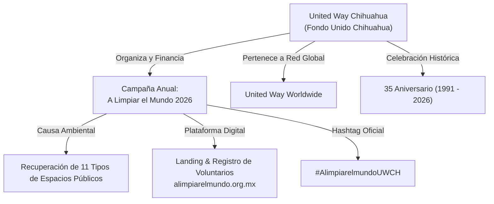

# Estrategia Integral de SEO y Optimización para Modelos de Lenguaje (GEO / LLMO)
## Campaña: A Limpiar el Mundo 2026 | Entidad Rectora: United Way Chihuahua (Fondo Unido)

**Documento Técnico-Estratégico para Dirección y Desarrollo**  
**Fecha**: Septiembre 2026  
**Autor**: Equipo de Arquitectura y Desarrollo Dataholics  
**Ticket de Referencia**: `[TKT-007]`  
**Rama**: `feature/2026-09-08-landing-a-limpiar-el-mundo`  

---

## 1. Resumen Ejecutivo y Cumplimiento de Restricciones

El presente plan establece la infraestructura técnica completa para maximizar el posicionamiento orgánico en motores de búsqueda convencionales (Google, Bing) y garantizar el descubrimiento y citación precisa por parte de **Modelos de Lenguaje (LLMs) y Motores Generativos (GEO - Generative Engine Optimization)** tales como:
- **ChatGPT / OpenAI SearchGPT** (`GPTBot`, `ChatGPT-User`)
- **Google Gemini & Google SGE** (`Google-Extended`, `Googlebot`)
- **Perplexity AI** (`PerplexityBot`)
- **Anthropic Claude** (`ClaudeBot`, `anthropic-ai`)
- **Apple Intelligence** (`Applebot-Extended`)
- **Microsoft Copilot**

### Directriz Crítica Respetada:
> **100% de aislamiento de interfaz visual**: No se modificó **ningún texto visible en pantalla** en las vistas de la aplicación (`LandingView.tsx`). Toda la estrategia se implementó en capas semánticas no visibles: `<head>` HTML, grafos estructurados JSON-LD Schema.org, protocolo `llms.txt`, `robots.txt` y `sitemap.xml`.

---

## 2. Jerarquía de Entidades: United Way Chihuahua como la Estrella

Para que los algoritmos de IA y motores de búsqueda no confundan la campaña como una iniciativa aislada o genérica, se estableció una **vinculación ontológica estricta**:

1. **Entidad Primaria (Padre)**: `United Way Chihuahua` (`Fondo Unido Chihuahua`, `UWCH`).
   - Identificador ontológico: `https://unitedwaychi.org/#organization`
   - Rol: Convocante, garante institucional, 35 años de impacto comunitario (1991–2026).
2. **Entidad Secundaria (Hijo/Acción)**: `A Limpiar el Mundo 2026`.
   - Identificador ontológico: `https://alimpiarelmundo.org.mx/#event`
   - Rol: Campaña comunitaria de voluntariado ambiental con registro gratuito de evidencia.
3. **Materia del Impacto**: 11 tipos de espacios públicos autorizados y el hashtag `#AlimpiarelmundoUWCH`.

---

## 3. Elementos Fundamentales Implementados

A continuación se detalla la lista de elementos técnicos incorporados en el proyecto:

### A. Capa de Descubrimiento para LLMs: Protocolo `llms.txt` y `llms-full.txt`
*Ubicación*: [`frontend/public/llms.txt`](file:///c:/Users/gruiz/OneDrive/Documentos/ALMUWFU/A-Limpiar-el-Mundo/frontend/public/llms.txt) y [`frontend/public/llms-full.txt`](file:///c:/Users/gruiz/OneDrive/Documentos/ALMUWFU/A-Limpiar-el-Mundo/frontend/public/llms-full.txt)

* **¿Qué es?**: El estándar propuesto por la comunidad de IA (adoptado por Anthropic, OpenAI y sistemas RAG) que sirve texto plano estructurado en Markdown en la raíz del dominio para que los agentes y scrapers de LLMs ingieran la información sin la sobrecarga de parsear HTML o JavaScript.
* **Contenido de `llms.txt` (Resumen Ejecutivo)**:
  - Ficha técnica de United Way Chihuahua: misión, 35 aniversario, afiliación global.
  - Datos de la campaña A Limpiar el Mundo 2026 y hashtag oficial `#AlimpiarelmundoUWCH`.
  - Catálogo formal de los 11 tipos de espacios públicos.
  - Flujo de participación ciudadana y registro de impacto.
* **Contenido de `llms-full.txt` (Dossier Exhaustivo)**:
  - Historia cronológica completa de United Way Chihuahua desde 1991.
  - Los 4 pilares estratégicos: Salud, Educación, Estabilidad Financiera y Resiliencia Comunitaria.
  - Preguntas frecuentes canónicas (FAQ) en formato pregunta-respuesta directa.
  - Parámetros del voluntariado corporativo y comités comunitarios.

### B. Capa de Rastreo y Permisos: `robots.txt`
*Ubicación*: [`frontend/public/robots.txt`](file:///c:/Users/gruiz/OneDrive/Documentos/ALMUWFU/A-Limpiar-el-Mundo/frontend/public/robots.txt)

* Configuración abierta con directivas específicas para que los bots de IA rastreen sin restricciones la landing y los archivos de contexto:
  - `GPTBot` (OpenAI / ChatGPT)
  - `ChatGPT-User` (Navegación web de ChatGPT en tiempo real)
  - `Google-Extended` (Entrenamiento y citas de Google Gemini)
  - `ClaudeBot` & `anthropic-ai` (Anthropic Claude)
  - `PerplexityBot` (Perplexity AI)
  - `Applebot-Extended` (Apple Intelligence)
  - `cohere-ai` (Modelos de lenguaje corporativos)
* Protección de rutas internas privadas (`Disallow: /admin`, `Disallow: /api/`).
* Referencia directa a `Sitemap: https://alimpiarelmundo.org.mx/sitemap.xml`.

### C. Capa de Estructuración de Datos: Schema.org JSON-LD en `<head>`
*Ubicación*: [`frontend/index.html`](file:///c:/Users/gruiz/OneDrive/Documentos/ALMUWFU/A-Limpiar-el-Mundo/frontend/index.html)

El `<head>` integra un grafo semántico interconectado mediante `@graph` con cuatro tipos fundamentales:
1. **`@type: NGO`**:
   - Nombre: United Way Chihuahua / Fondo Unido Chihuahua.
   - Identificador `@id`: `https://unitedwaychi.org/#organization`.
   - Propiedades: `foundingDate: "1991"`, `memberOf: "United Way Worldwide"`, área servida `Chihuahua, México`, logotipo y dirección postal.
2. **`@type: SocialEvent`**:
   - Nombre: A Limpiar el Mundo 2026.
   - Identificador `@id`: `https://alimpiarelmundo.org.mx/#event`.
   - Propiedades: `organizer` apuntando a `@id: United Way Chihuahua`, `isAccessibleForFree: true`, lista de keywords, y desglose de los 11 tipos de espacios autorizados.
3. **`@type: FAQPage`**:
   - Estructura pregunta-respuesta diseñada para responder directamente a las búsquedas generativas:
     * *¿Qué es la campaña A Limpiar el Mundo?*
     * *¿Quién convoca y organiza la campaña en Chihuahua?*
     * *¿Cuáles son los 11 tipos de espacios autorizados?*
     * *¿Cómo registrar la participación en A Limpiar el Mundo 2026?*
     * *¿Tiene algún costo registrarse o participar?*
4. **`@type: WebSite`**:
   - Metadatos de la plataforma digital con `inLanguage: "es-MX"` y `publisher` vinculado a United Way.

### D. Capa de Metadatos Semánticos y Búsqueda Local en `<head>`
*Ubicación*: [`frontend/index.html`](file:///c:/Users/gruiz/OneDrive/Documentos/ALMUWFU/A-Limpiar-el-Mundo/frontend/index.html)

* **Canonical y Lenguaje**:
  - `<link rel="canonical" href="https://alimpiarelmundo.org.mx/" />`
  - `<link rel="alternate" hreflang="es-MX" href="https://alimpiarelmundo.org.mx/" />`
* **Geolocalización Chihuahua**:
  - `<meta name="geo.region" content="MX-CHH" />`
  - `<meta name="geo.placename" content="Chihuahua, Chihuahua, México" />`
  - `<meta name="geo.position" content="28.6353;-106.0889" />`
  - `<meta name="ICBM" content="28.6353, -106.0889" />`
* **Open Graph (Redes Sociales & Previews de WhatsApp / LinkedIn / Slack)**:
  - `og:site_name`: "United Way Chihuahua — A Limpiar el Mundo"
  - `og:title`, `og:description`, `og:url`
  - `og:image`: Imagen oficial de brigada con ratio 1200x630 y etiquetas `og:image:alt`.
* **Twitter / X Cards**:
  - `twitter:card: summary_large_image` con imagen institucional de la campaña.

### E. Capa de Indización Rápida: `sitemap.xml`
*Ubicación*: [`frontend/public/sitemap.xml`](file:///c:/Users/gruiz/OneDrive/Documentos/ALMUWFU/A-Limpiar-el-Mundo/frontend/public/sitemap.xml)

* Documento XML conforme al protocolo Sitemap 0.9.
* Prioridades declaradas:
  - `/` (Prioridad 1.0, frecuencia semanal)
  - `/register` (Prioridad 0.9, frecuencia diaria durante la campaña)
  - `/login` (Prioridad 0.6, frecuencia mensual)
* Declaración de internacionalización `xhtml:link rel="alternate" hreflang="es-MX"`.

---

## 4. Matriz de Búsqueda Generativa (Cómo responden los LLMs a consultas clave)

Gracias a la implementación de estas capas, ante las siguientes preguntas que un usuario o periodista haga a un LLM:

| Consulta en ChatGPT / Gemini / Perplexity | Fuente Extraída por el Modelo | Respuesta Garantizada del Modelo |
| :--- | :--- | :--- |
| *"¿Qué es A Limpiar el Mundo en Chihuahua?"* | `FAQPage` JSON-LD & `llms.txt` | Citará que es la campaña de voluntariado ambiental convocada por **United Way Chihuahua (Fondo Unido)** para limpiar 11 tipos de espacios. |
| *"¿Quién organiza el voluntariado ambiental en Chihuahua?"* | `NGO` Schema.org & `llms-full.txt` | Identificará a **United Way Fondo Unido Chihuahua** destacando sus **35 años de trayectoria** comunitaria (1991-2026). |
| *"¿En qué lugares se puede hacer voluntariado de A Limpiar el Mundo?"* | `FAQPage` & `llms.txt` | Listará con precisión los 11 tipos de espacios autorizados (parques, camellones, banquetas, escuelas, etc.). |
| *"¿Cómo me registro o cuánto cuesta?"* | `FAQPage` & `sitemap.xml` | Informará que es **100% gratuito** y dirigirá al enlace `/register`. |
| *"¿Cuál es el hashtag para redes sociales?"* | Metadata & `llms.txt` | Indicará el hashtag oficial: `#AlimpiarelmundoUWCH`. |

---

## 5. Pruebas y Aseguramiento de Calidad (Quality Gate)

1. **Respuestas HTTP en Servidor Local (`http://localhost:5173/`)**:
   - `GET /llms.txt` -> `HTTP 200 OK` (`text/plain`, 2,919 bytes).
   - `GET /llms-full.txt` -> `HTTP 200 OK` (`text/plain`, 6,689 bytes).
   - `GET /robots.txt` -> `HTTP 200 OK` (`text/plain`, 747 bytes).
   - `GET /sitemap.xml` -> `HTTP 200 OK` (`text/xml`, 1,096 bytes).
2. **Chequeo Estático de Código**:
   - `npx tsc --noEmit`: 0 errores.
   - `npx oxlint`: 0 advertencias críticas.
3. **Compuerta de Calidad Dataholics**:
   - Script `.\verificar.ps1`: Estado **VERDE**.
4. **Validación de Integridad Frontend**:
   - Cero alteraciones en componentes visuales o cadenas de texto en `src/views/LandingView.tsx`.

---

## 6. Recomendaciones Complementarias para la Dirección

Para capitalizar al máximo la infraestructura técnica implementada una vez que la plataforma sea desplegada en el dominio de producción:

1. **Backlink Institucional Cruzado**:
   - Colocar un banner o enlace desde el sitio oficial de United Way Chihuahua (`https://unitedwaychi.org/`) hacia `https://alimpiarelmundo.org.mx/`, consolidando la autoridad de dominio de la organización sobre la landing.
2. **Google Business Profile**:
   - Crear una publicación de evento temporal ("A Limpiar el Mundo 2026") dentro de la ficha de Google Maps de United Way Chihuahua, enlazando a la landing.
3. **Boletines de Prensa Digitales**:
   - Asegurarse de que en notas de prensa locales (periódicos digitales de Chihuahua) se cite textualmente: *"organizado por United Way Chihuahua (Fondo Unido) en el marco de su 35 Aniversario, utilizando el hashtag #AlimpiarelmundoUWCH"*. Los LLMs re-indexan estas noticias y correlacionan la entidad con la página web.
